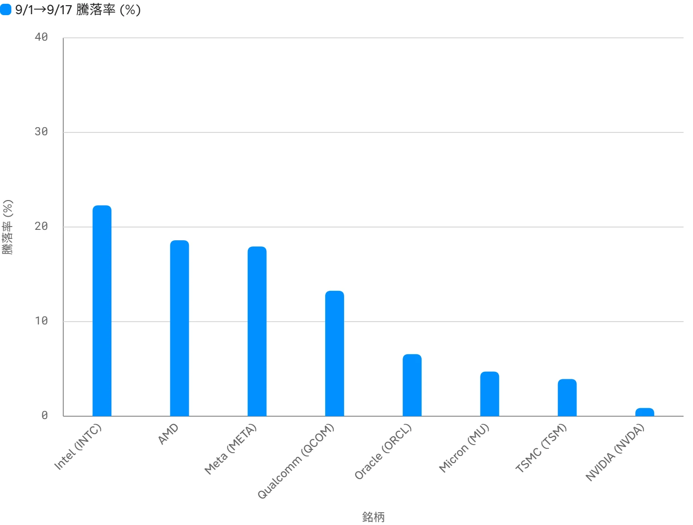

<!--
id: RX-USECASE-0065
type: use-case
language: ko
locale: ko-KR
provider: QUICK Inc.
provided: 2026-09-18
status: published
translation_status: current
original_language: en
source_text_status: localized_from_en_canonical
source_type: partner-provided-use-case
asset_class: Equities
publication_mode: faithful-source-preserving
-->

# 상승한 미국 종목에서 관련 일본 기업을 찾기

[← 주식 유스케이스](README.md) · [운용자산별 유스케이스](../README.md) · [전체 유스케이스](../../README.md)

**제공일:** 2026-09-18
**주요 운용자산:** 주식

> 이 예시의 수치와 시장 환경은 제공일 당시의 스냅샷입니다.

> ### [Reflexivity에서 이 리서치 예제를 열기 →](https://app.reflexivity.com/alfred?mode=research&conversationId=8d4011b7-597b-4361-ad87-501046a67b28&scrollTo=top)

## 질문

**9월 초부터 어제까지 상승한 미국 업종과 주요 종목을 찾고, 그 기업들과 관련된 일본 기업을 나열해 주세요.**

## 먼저 미국 시장의 주도주를 좁힌다

분석은 2026년 9월 1일부터 9월 17일까지 미국 시장에서 상승한 종목을 먼저 찾고, 그 주도주를 출발점으로 일본 공급망과의 연결을 추적합니다.

반도체에서는 Intel, AMD, Qualcomm이 강세를 주도했습니다. AI/플랫폼에서는 Meta, AI/클라우드에서는 Oracle이 상승했습니다. 같은 기간 Nvidia는 거의 보합이어서 반도체 안에서도 성과가 달랐음을 보여줍니다.

| 기업 | 테마 / 업종 | 수익률 | 가격, 9월 1일 → 9월 17일 |
| --- | --- | ---: | --- |
| Intel | 반도체 | +22.3% | $88.97 → $108.80 |
| AMD | 반도체 | +18.6% | $459.61 → $545.09 |
| Meta | AI / 플랫폼 | +17.9% | $578.54 → $682.31 |
| Qualcomm | 반도체 | +13.3% | $166.61 → $188.71 |
| Oracle | AI / 클라우드 | +6.6% | $141.32 → $150.59 |
| Micron | 메모리 반도체 | +4.7% | $933.44 → $977.50 |
| TSMC | 파운드리 | +3.9% | $414.00 → $430.26 |

## 이 움직임을 일본 기업으로 연결하는 방법

다음 단계에서는 상승한 미국 종목을 **반도체 제조장비, 소재·기판, 메모리, 파운드리 노출, AI 칩 후공정** 같은 공급망 범주로 나눕니다.

### 반도체 제조장비

미국 측 수요 동인에는 Intel, AMD, Nvidia, TSMC 등 반도체 기업의 설비투자가 포함됩니다. 원 자료가 제시한 일본 기업은 다음과 같습니다.

- Tokyo Electron (8035)
- Lasertec (6920)
- Disco (6146)
- Advantest (6857)
- Kokusai Electric (6525)
- Towa (6315)
- Tokyo Seimitsu (7729)
- SCREEN Holdings (7735)

### 반도체 소재와 기판

- SUMCO (3436)
- Tokyo Ohka Kogyo (4186)
- Shin-Etsu Chemical (4063)
- Ibiden (4062)
- Fujimi Incorporated (5384)
- Taiyo Holdings (4626)
- C. Uyemura (4966)
- HOYA (7741)

### 메모리와 후공정

원 자료는 Kioxia, Kokusai Electric, Towa, Advantest, Disco, Lasertec도 메모리 업황 및 AI 칩 후공정·검사 수요와 연결합니다.

## 이 워크플로가 유용한 이유

정적인 일본 반도체 종목 목록에서 출발하는 것이 핵심이 아닙니다. 순서는 다음과 같습니다.

**현재 가격 강도가 나타난 미국 종목 식별 → 상승을 만든 업종·테마 분류 → 지식그래프로 관련 일본 기업 확장**

이렇게 하면 일반적인 섹터 스크리닝을 실제 시장에서 의미 있는 움직임이 나타난 기업을 출발점으로 하는 리서치 경로로 바꿀 수 있습니다.

## 한계

- 일본 기업과의 관계는 지식그래프에 표현된 일반적인 공급망·테마 연결을 반영합니다.
- 각 일본 기업의 구체적인 수주금액이나 매출 영향은 검증하지 않습니다.
- 관측기간이 약 2주로 짧고 같은 업종 안에서도 주가 성과 차이가 큽니다.
- 가격과 수익률은 제공된 Reflexivity 분석의 일별 종가를 기준으로 합니다.

Intel, AMD, Qualcomm 같은 특정 미국 기업의 경쟁사와 공급업체를 추가로 추적해 워크플로를 확장할 수 있습니다.

---

본 콘텐츠는 QUICK에서 제공한 자료입니다.

국가·지역, 언어 환경, 이용 제품, 권한 및 데이터 제공 범위에 따라 이 예시를 그대로 재현하기 어려울 수 있습니다.

[← 주식 유스케이스](README.md) · [운용자산별 유스케이스](../README.md) · [전체 유스케이스](../../README.md)
