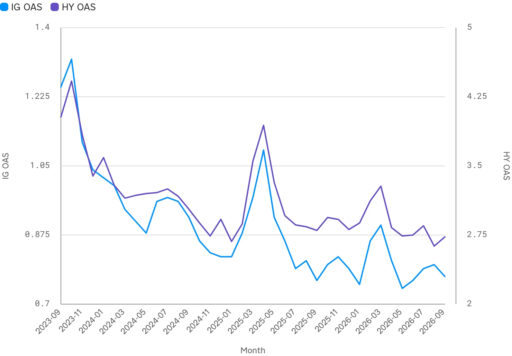

<!--
id: RX-USECASE-0067
type: use-case
language: ko
locale: ko-KR
provider: QUICK Inc.
provided: 2026-09-25
status: published
translation_status: current
original_language: en
source_text_status: localized_from_en_canonical
source_type: partner-provided-use-case
asset_class: Fixed Income, Macro
publication_mode: faithful-source-preserving
-->
# 미국 채권발행시장을 발행주체·자금용도·수급·금리로 분석하기

[← 채권 유스케이스](README.md) · [운용자산별 유스케이스](../README.md) · [전체 유스케이스](../../README.md)

**제공일:** 2026-09-25
**주요 운용자산:** 채권, 매크로

> 이 예시의 수치와 시장 환경은 제공일 당시의 스냅샷입니다.

> ### [Reflexivity에서 이 리서치 예제를 열기 →](https://app.reflexivity.com/alfred?mode=research&conversationId=71c1788f-7e54-4620-a6b2-ab163bd6762f&scrollTo=top)

## 질문

**미국의 채권 발행이 늘고 있습니다. 주요 발행주체와 자금용도를 분석하고, 수급 상황과 금리 변화도 함께 살펴봐 주세요.**

## 누가 왜 발행하는지부터 본다

원 자료는 미국 채권 발행이 국채와 회사채 모두에서 확대되고 있다고 설명합니다.

주요 발행주체는 대규모 재정적자를 조달하는 **미국 재무부**와 AI·데이터센터 투자를 위한 자금을 조달하는 대형 **투자등급 기업**입니다. Alphabet과 Oracle은 대규모 채권을 발행한 기술기업 사례로 제시됩니다.

자금용도는 다음과 같이 나뉩니다.

- 미국 재무부: 재정적자 조달
- 기업: AI·데이터센터 설비투자
- 차입비용이 더 오르기 전 차환
- M&A·LBO 자금조달
- 자사주매입 등 주주환원

## 금리는 올랐고 특히 장기물이 더 상승했다

| 지표 | 최신값 (2026-09-23) | 1년 전 | 변화 |
| --- | ---: | ---: | ---: |
| 미국 2년물 국채금리 | 4.85% | 3.53% | +1.32%p |
| 미국 10년물 국채금리 | 5.11% | 4.12% | +0.99%p |
| 미국 30년물 국채금리 | 5.40% | 4.73% | +0.67%p |
| 실효 연방기금금리 | 3.63% | 4.33% | -0.70%p |
| IG 회사채 OAS | 0.77% | 0.75% | +0.02%p |
| HY 회사채 OAS | 2.73% | 2.71% | +0.02%p |
| IG 유효수익률 | 5.83% | 4.76% | +1.07%p |
| HY 유효수익률 | 7.68% | 6.40% | +1.28%p |

원 자료는 단기 정책금리가 내려가는 동안 장기 국채금리가 오르는 조합을 **베어 스티프닝**의 한 형태로 해석합니다.

## 발행이 많았지만 크레딧 스프레드는 타이트했다

기록적인 공급에도 불구하고 제공일 당시 IG와 HY 스프레드는 역사적으로 타이트한 수준을 유지했습니다.

따라서 발행 증가를 곧바로 수요 약화로 해석해서는 안 됩니다. 원 자료는 오히려 **높은 절대금리가 충분한 투자수요를 끌어들여 대규모 공급을 흡수하고 있다**고 해석합니다.

## 부채잔액 증가로 공급을 근사한다

연방정부 부채는 약 39조 달러까지 늘었고, 비금융기업 채권잔액은 약 16조 달러에 도달한 것으로 설명됩니다.

원 자료는 총발행액의 직접 시계열을 확보하지 못해 **부채잔액의 전년 대비 순증가분이라는 stock 지표**로 공급을 근사합니다. 이는 gross issuance라는 flow와 개념적으로 다르므로 결과를 해석할 때 구분해야 합니다.

## 공급·수요·금리를 함께 읽는다

이 워크플로의 목적은 발행 규모만 따로 보는 것이 아닙니다. 시장을 다음 순서로 연결합니다.

**발행주체 → 자금용도 → 국채·회사채 공급 → 장기금리 → 크레딧 스프레드 → 투자수요**

원 자료는 Fed의 금리인하에도 장기금리가 오른 배경을 대규모 국채·회사채 발행과 높아진 텀프리미엄에 연결합니다. 동시에 타이트한 크레딧 스프레드는 **큰 공급과 강한 수요가 함께 존재하고 있었음**을 보여줍니다.

## 한계

- 공급은 직접적인 gross issuance가 아니라 부채잔액의 전년 대비 증가로 근사합니다.
- 일부 투자등급 발행규모는 1차 발행 데이터베이스가 아니라 2차 시장 코멘터리에 근거합니다.
- 부채잔액은 분기 데이터이고 금리·스프레드는 일별 데이터여서 관측일이 다릅니다.
- 특정 수치를 확인할 때는 관련 FRED·SIFMA 시계열과 날짜를 함께 확인하는 것이 좋습니다.

추가로 AI 관련 기업의 발행이나 미국 국채 입찰의 bid-to-cover 비율을 분석해 수급을 더 깊게 볼 수 있습니다.

---

본 콘텐츠는 QUICK에서 제공한 자료입니다.

국가·지역, 언어 환경, 이용 제품, 권한 및 데이터 제공 범위에 따라 이 예시를 그대로 재현하기 어려울 수 있습니다.

[← 채권 유스케이스](README.md) · [운용자산별 유스케이스](../README.md) · [전체 유스케이스](../../README.md)
